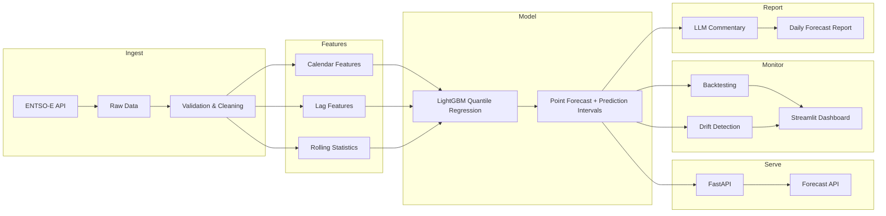

# GridCast

Probabilistic forecasting of Dutch electricity load with prediction intervals,
backtesting, drift monitoring, automated retraining, and LLM-generated daily
forecast reports.

Built with real data from the ENTSO-E Transparency Platform.

## Why this project

In 2022 I built demand forecasting at a food company that hit 95 % accuracy
against a 99 % business threshold and never reached production. GridCast is me
doing it properly — every component is tested, monitored, and deployed.

## Architecture



## Project structure
## Tech stack

- Python 3.11, uv for dependency management
- pandas, polars, scikit-learn, LightGBM (quantile regression), statsmodels
- FastAPI, Docker, GitHub Actions
- pytest, Streamlit dashboard
- Anthropic/OpenAI API for forecast commentary only

## Setup

```bash
# Install uv (if not installed)
# Windows: powershell -ExecutionPolicy ByPass -c "irm https://astral.sh/uv/install.ps1 | iex"
# Linux/Mac: curl -LsSf https://astral.sh/uv/install.sh | sh

# Clone and install
git clone https://github.com/YOUR_USERNAME/gridcast.git
cd gridcast
uv sync

# Copy .env.example to .env and add your ENTSO-E API key
cp .env.example .env
```

## Status

🚧 Phase 0 — Project scaffolding and data access
