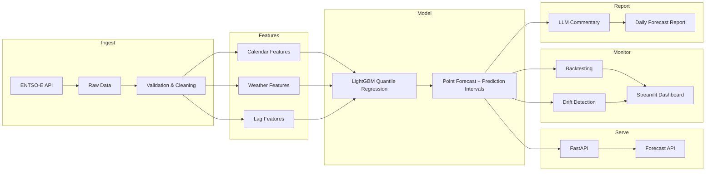

# GridCast

Probabilistic forecasting of Dutch hourly electricity load with prediction
intervals, backtesting, drift monitoring, automated retraining, and
LLM-generated daily forecast reports. Built on real data from the ENTSO-E
Transparency Platform and Open-Meteo.

**Status: Phase 2 (models & backtesting) complete.** Data pipeline and
modeling are built and tested; probabilistic intervals, serving, and
monitoring are planned - see roadmap.

## Why this project

In 2022 I built demand forecasting at a food company that hit 95% accuracy
against a 99% business threshold and never reached production. GridCast is
me doing it properly: the goal is a system where every component is tested,
monitored, and deployed - with honest evaluation and explicit uncertainty.

## Target architecture

The Ingest, Features, and point-forecast Model stages are built (quantile
regression is Phase 3); Serve, Monitor, and Report are roadmap.

## What works today

One command builds a model-ready feature table from an empty data folder:

    uv run python -m gridcast.build --years 3

This fetches ~3 years of Dutch load (actual + TSO day-ahead forecast) at
native 15-minute resolution, caches it as monthly parquet, cleans it,
aggregates to hourly, joins population-weighted national weather and
calendar features, and writes `data/processed/features.parquet`
(~26,900 hourly rows, 13 columns). Re-runs are idempotent: immutable
months and cached weather are skipped; recent months are refetched
because ENTSO-E revises recent actuals. `--offline` rebuilds everything
from the raw cache with no network.

On top of that, the modeling layer runs the full Phase 2 evaluation:

    uv run python -m gridcast.models.backtest      # baselines + SARIMAX, 140 folds
    uv run python -m gridcast.models.run_lgbm      # LightGBM on the same folds
    uv run python -m gridcast.models.run_ablation  # feature-group ablations
    uv run python -m gridcast.models.compare       # failure-mode breakdowns
    uv run python -m gridcast.models.run_holdout   # one-shot frozen holdout

## Results (Phase 2)

24h-ahead hourly forecasts, evaluated on 140 rolling-origin backtests
(5-day steps, expanding window, ~3 years of data) plus a frozen holdout
scored exactly once, after all modeling decisions were fixed:

| Model | Dev MAE (MW) | Holdout MAE (MW) | MAPE |
|---|---|---|---|
| LightGBM (lags + calendar + weather) | 270 | 297 | 2.2% |
| SARIMAX (Fourier terms + ARMA errors) | 667 | 569 | 4.2% |
| Seasonal naive (same hour last week) | 565 | 570 | 4.3% |

LightGBM roughly halves the error of the weekly seasonal naive and beat
it on 88.9% of holdout days; the dev-to-holdout degradation was +10%,
i.e. the backtest estimate was honest. Weather features use historical
actuals (perfect prognosis, stated below); the no-weather ablation
brackets production skill at 2.2-2.3% MAPE. The TSO day-ahead forecast
was evaluated as a feature and as a benchmark: it is systematically
amplitude-damped for NL, adds no marginal accuracy as a feature, and was
dropped from the production configuration to remove a runtime dependency.

Averages are not the whole story - the per-horizon, per-hour, and
per-fold breakdowns live in `reports/phase2/`. The model's remaining
errors concentrate at midday and the evening ramp (weather-driven), and
its single worst backtest day (2024-12-16) was a warm winter Monday
where the learned temperature-demand relationship failed - the TSO's
forecast made the same directional error. That day is the motivating
example for the prediction intervals in Phase 3.

## Pipeline design

- **UTC everywhere, local time only as features.** The index is tz-aware
  UTC end to end; Europe/Amsterdam appears only transiently to derive
  calendar features, because load follows the local clock but gap
  detection and joins only make sense in UTC (every UTC day has 24
  hours; local days have 23 or 25 twice a year).
- **Detect and repair are separate.** `quality.py` only reports (gaps,
  duplicates, physical bounds, flatlines, spikes); `clean.py` repairs,
  and logs every repair with timestamps.
- **Sag vs. event.** Single-point outliers are repaired only when the
  value jumps >2 GW and immediately returns. A 4.5 GW drop that
  persisted (2026-06-25) is kept - it is data, not noise.
- **The day-ahead series is never value-repaired.** It is a covariate:
  the model must train on exactly what the TSO publishes, because that
  is what it receives at prediction time.
- **No silent row loss.** Covariates left-join onto the target spine;
  missing values stay visible as NaN and coverage is logged.

## Modeling design

- **Chronological evaluation only.** Random splits are invalid for
  forecasting: hourly load autocorrelation means randomly held-out
  hours have near-duplicate neighbours in training, so CV measures
  interpolation while production requires extrapolation. Everything is
  rolling-origin: train on `[start, origin)`, forecast
  `[origin, origin+24h)`, step forward, repeat.
- **The origin step must not alias the seasonality.** The original
  7-day fold step made every test day a Saturday; the step is 5 days
  (coprime with 7) so all weekdays are evaluated. Caught by reading
  the per-horizon error table, not by luck.
- **Leak-proof by construction, not by vigilance.** One feature builder,
  parameterized by forecast origin, generates both training rows
  (replayed historical origins) and inference rows. Rolling statistics
  are origin-anchored; lags unavailable at a given horizon are NaN in
  training and serving alike. A leakage canary test corrupts every
  target value at/after the origin and asserts zero feature bits change.
- **One direct model for all 24 horizons**, with horizon as a feature -
  horizons share structure, data is pooled, and trees split on horizon
  where behaviour differs.
- **Fixed conservative hyperparameters, no tuning on the backtest.**
  Selecting a config by re-running the folds and keeping the best table
  makes the folds the training signal for the config (evaluation-
  selection leakage) and overstates fresh-data skill. Early stopping
  uses a chronological (never random) validation slice.
- **SARIMAX as dynamic harmonic regression.** Classical SARIMA with
  s=168 is computationally infeasible and single-seasonal; Fourier
  terms for the 24h and 168h cycles + ARMA(2,1) errors on an 8-week
  trailing window handle both cycles cheaply. Its role is the honest
  classical-statistics control, not the product.

## A finding from the data

An initial physical lower bound of 4 GW for Dutch load flagged 368
"impossible" points. Investigation showed they were real: long smooth
runs at local hours 10-17, summer only, deepening year over year, down
to 327 MW - the midday collapse of *net* load driven by rooftop solar,
which sits behind the meter and subtracts from what ENTSO-E measures.
The fix was to the check (bound lowered to what remains physically
impossible), not to the data. Two genuine telemetry sags found in the
same investigation are repaired by the cleaning rules.

## A second finding from the data

The frozen holdout detected a live upstream data incident: from late
June 2026, ENTSO-E's published NL actual load collapsed to physically
implausible values (down to ~330 MW national midday load) while the
TSO's independent day-ahead forecast stream stayed normal. Refetching
showed ENTSO-E has since revised late June to sane values; July 2026
remains corrupted pending revision. Holdout scoring quarantines the
affected window and reports it separately. The practical lesson feeds
Phase 4: recently published actuals are provisional and need
plausibility gates and trailing-window re-verification before a
daily-retraining system may ingest them.

## Known limitations (deliberate, documented)

- Weather history is ERA5 reanalysis (what the weather *was*); in
  production the model will receive weather *forecasts*. This
  train/serve skew is accepted for now; training on historical
  forecasts is the rigorous upgrade. The no-weather ablation bounds
  the maximum possible impact.
- SARIMAX trains on an 8-week trailing window (compute budget for 140
  refits); LightGBM sees full history. Stated rather than hidden.
- The ENTSO-E day-ahead benchmark has an earlier information cutoff
  (~noon D-1) than our midnight origins, which slightly favours our
  models; the debiased variant uses realized actuals TenneT did not
  have, which cuts the other way. Both are footnoted, not corrected.
- Dutch school vacations (staggered across three regions) are not yet
  a feature; the worst backtest folds cluster on holiday-adjacent and
  DST-adjacent days.
- City weights for the national weather aggregate are approximate,
  Randstad-heavy; CBS population data would make them rigorous.
- The static lower load bound cannot catch a night-time sag to a few
  hundred MW; spike and flatline checks are the backstop.
- The holdout cutoff is computed relative to the end of the data
  ("last 56 days"); a rebuild that appends data silently shifts it.
  Phase 3 pins the cutoff to a fixed timestamp in config.
- ENTSO-E actuals for July 2026 are corrupted upstream (see second
  finding); evaluation code quarantines the window until revised.
- Open-Meteo's archive API lags ~5 days behind real time, leaving
  recent hours without weather; production needs a fallback to the
  forecast endpoint.

## Project structure

    gridcast/
    |-- src/gridcast/
    |   |-- data/        # ENTSO-E client, weather, quality checks, cleaning
    |   |-- features/    # Calendar features, feature-table build
    |   |-- models/      # Splits, metrics, baselines, SARIMAX, LightGBM,
    |   |                # backtest harness, ablations, holdout evaluation
    |   |-- api/         # (Phase 4) FastAPI forecast endpoint
    |   |-- monitoring/  # (Phase 4) Drift detection, quality tracking
    |   |-- build.py     # One-command raw -> clean -> features pipeline
    |-- data/            # Raw & processed data (gitignored, reproducible)
    |-- notebooks/       # Exploration & diagnosis only - logic lives in src/
    |-- reports/         # Generated evaluation reports (phase2/)
    |-- tests/           # 55 unit tests, no network required
    |-- configs/         # Model hyperparameters (Phase 3+)

## Testing

`uv run pytest` - 55 unit tests, no network required. Highlights: DST
boundary behaviour on both switch days; rolling-origin folds proven
non-overlapping and midnight-aligned; Fourier regressors tested for
actual periodicity (which caught a timestamp-resolution bug that gave
the daily seasonal term a ~1000-day wavelength); a leakage canary that
corrupts every target value at/after the forecast origin and asserts
zero feature bits change; and a context-independence test proving a
feature row built alone (inference) is bit-identical to the same row
built during training replay.

## Setup

    # Install uv
    # Windows: powershell -ExecutionPolicy ByPass -c "irm https://astral.sh/uv/install.ps1 | iex"
    # Linux/Mac: curl -LsSf https://astral.sh/uv/install.sh | sh

    git clone https://github.com/AashishS97/gridcast.git
    cd gridcast
    uv sync
    cp .env.example .env   # add your free ENTSO-E API key
    uv run python -m gridcast.build --years 3

## Roadmap

1. ~~Data pipeline: ENTSO-E client, quality checks, cleaning, calendar +
   weather features, reproducible build~~ (done)
2. ~~Point models & backtesting: time-series splits, baselines, SARIMAX,
   LightGBM with leak-proof multi-horizon features, ablations, frozen
   holdout~~ (done)
3. Probabilistic forecasts: LightGBM quantile regression, calibrated
   prediction intervals
4. Serving: FastAPI + Docker, scheduled retraining, drift monitoring,
   Streamlit dashboard
5. LLM-generated daily forecast commentary

## Tech stack

Python 3.11, uv, pandas, LightGBM, statsmodels, FastAPI, Docker,
GitHub Actions, pytest, Streamlit. Data: ENTSO-E Transparency
Platform, Open-Meteo (ERA5). Anthropic/OpenAI API for forecast
commentary only.
