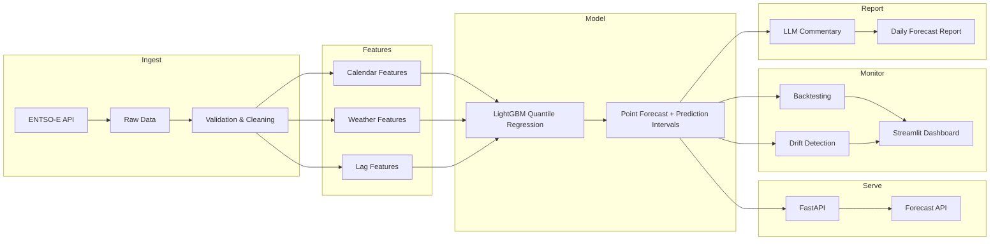

# GridCast

Probabilistic forecasting of Dutch hourly electricity load with prediction
intervals, backtesting, drift monitoring, automated retraining, and
LLM-generated daily forecast reports. Built on real data from the ENTSO-E
Transparency Platform and Open-Meteo.

**Status: Phase 1 (data pipeline) complete and tested.** Modeling,
backtesting, serving, and monitoring are planned - see roadmap.

## Why this project

In 2022 I built demand forecasting at a food company that hit 95% accuracy
against a 99% business threshold and never reached production. GridCast is
me doing it properly: the goal is a system where every component is tested,
monitored, and deployed - with honest evaluation and explicit uncertainty.

## Target architecture

The Ingest and Features stages (minus lag features, which are
horizon-dependent and belong to modeling) are built; the rest is roadmap.

## What works today

One command builds a model-ready feature table from an empty data folder:

    uv run python -m gridcast.build --years 3

This fetches ~3 years of Dutch load (actual + TSO day-ahead forecast) at
native 15-minute resolution, caches it as monthly parquet, cleans it,
aggregates to hourly, joins population-weighted national weather and
calendar features, and writes `data/processed/features.parquet`
(~26,900 hourly rows, 13 columns). Re-runs are idempotent: immutable
months and cached weather are skipped; recent months are refetched
because ENTSO-E revises recent actuals. `--offline` rebuilds everything
from the raw cache with no network.

## Pipeline design

- **UTC everywhere, local time only as features.** The index is tz-aware
  UTC end to end; Europe/Amsterdam appears only transiently to derive
  calendar features, because load follows the local clock but gap
  detection and joins only make sense in UTC (every UTC day has 24
  hours; local days have 23 or 25 twice a year).
- **Detect and repair are separate.** `quality.py` only reports (gaps,
  duplicates, physical bounds, flatlines, spikes); `clean.py` repairs,
  and logs every repair with timestamps.
- **Sag vs. event.** Single-point outliers are repaired only when the
  value jumps >2 GW and immediately returns. A 4.5 GW drop that
  persisted (2026-06-25) is kept - it is data, not noise.
- **The day-ahead series is never value-repaired.** It is a covariate:
  the model must train on exactly what the TSO publishes, because that
  is what it receives at prediction time.
- **No silent row loss.** Covariates left-join onto the target spine;
  missing values stay visible as NaN and coverage is logged.

## A finding from the data

An initial physical lower bound of 4 GW for Dutch load flagged 368
"impossible" points. Investigation showed they were real: long smooth
runs at local hours 10-17, summer only, deepening year over year, down
to 327 MW - the midday collapse of *net* load driven by rooftop solar,
which sits behind the meter and subtracts from what ENTSO-E measures.
The fix was to the check (bound lowered to what remains physically
impossible), not to the data. Two genuine telemetry sags found in the
same investigation are repaired by the cleaning rules.

## Known limitations (deliberate, documented)

- Weather history is ERA5 reanalysis (what the weather *was*); in
  production the model will receive weather *forecasts*. This
  train/serve skew is accepted for now; training on historical
  forecasts is the rigorous upgrade.
- Dutch school vacations (staggered across three regions) are not yet
  a feature.
- City weights for the national weather aggregate are approximate,
  Randstad-heavy; CBS population data would make them rigorous.
- The static lower load bound cannot catch a night-time sag to a few
  hundred MW; spike and flatline checks are the backstop.

## Project structure

    gridcast/
    |-- src/gridcast/
    |   |-- data/        # ENTSO-E client, weather, quality checks, cleaning
    |   |-- features/    # Calendar features, feature-table build
    |   |-- models/      # (Phase 2) LightGBM quantile regression
    |   |-- api/         # (Phase 4) FastAPI forecast endpoint
    |   |-- monitoring/  # (Phase 4) Drift detection, quality tracking
    |   |-- build.py     # One-command raw -> clean -> features pipeline
    |-- data/            # Raw & processed data (gitignored, reproducible)
    |-- notebooks/       # Exploration only - logic lives in src/
    |-- tests/           # 23 unit tests, no network required
    |-- configs/         # Model hyperparameters (Phase 2+)

## Testing

`uv run pytest` - 23 unit tests, no network required, including DST
boundary behaviour on both switch days, a leakage test that perturbs
future values and asserts past features are unchanged, and the
sag-vs-persistent-event distinction.

## Setup

    # Install uv
    # Windows: powershell -ExecutionPolicy ByPass -c "irm https://astral.sh/uv/install.ps1 | iex"
    # Linux/Mac: curl -LsSf https://astral.sh/uv/install.sh | sh

    git clone https://github.com/AashishS97/gridcast.git
    cd gridcast
    uv sync
    cp .env.example .env   # add your free ENTSO-E API key
    uv run python -m gridcast.build --years 3

## Roadmap

1. ~~Data pipeline: ENTSO-E client, quality checks, cleaning, calendar +
   weather features, reproducible build~~ (done)
2. Modeling: horizon-aware lag features, LightGBM quantile regression,
   calibrated prediction intervals
3. Backtesting: rolling-origin evaluation against the TSO day-ahead
   baseline
4. Serving: FastAPI + Docker, scheduled retraining, drift monitoring,
   Streamlit dashboard
5. LLM-generated daily forecast commentary

## Tech stack

Python 3.11, uv, pandas, LightGBM, statsmodels, FastAPI, Docker,
GitHub Actions, pytest, Streamlit. Data: ENTSO-E Transparency
Platform, Open-Meteo (ERA5). Anthropic/OpenAI API for forecast
commentary only.
